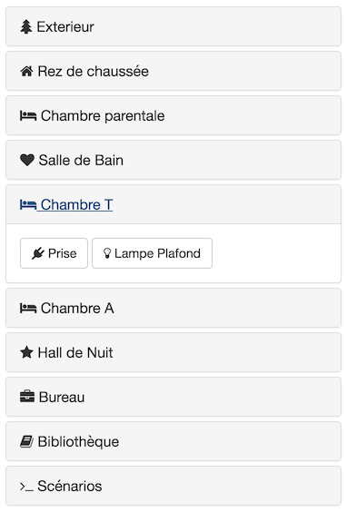

# Web interface for Controller Home Control (NHC)

> **Warning WIP !** Use it at you own risk.

This project is a remastering of [jaader/PortailNHC](https://github.com/jaader/PortailNHC).

It's a web interface that control [Controller Home Control](http://www.niko.eu/frbe/niko/nhc-landingspage) electrical installation.

 
 
## Usage

From the project root folder :

* **PHP Serv** : Use the interal PHP server with `php -S 0.0.0.0:8080 -t dev/public` 
* **Docker** : you can use `docker-compose start` from the project root folder.

For exemple you can install this application on a Raspberry PI connected to your local network.
